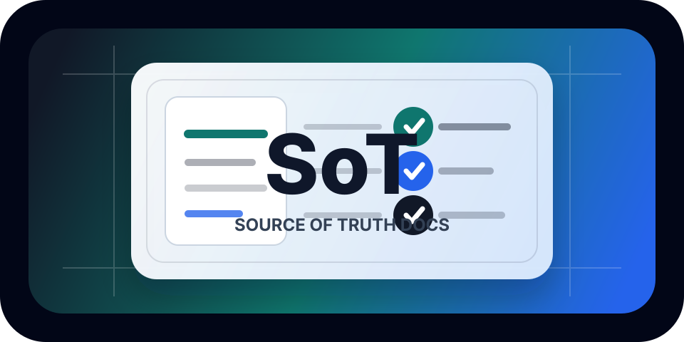

# Source of Truth Docs Skills

<p align="center">
  
</p>

<p align="center">
  <a href="https://github.com/elvincth/source-of-truth-docs-skills">
    
  </a>
  <a href="https://github.com/vercel-labs/skills">
    
  </a>
  <a href="https://openai.com/index/harness-engineering/">
    
  </a>
</p>

`source-of-truth-docs-skills` helps agents create and maintain repository documentation that acts as the project's source of truth.

It is inspired by OpenAI's Harness Engineering post and Karpathy-style coding guidelines. The combined idea is simple: put durable project knowledge in the repo, make it easy to navigate, and edit docs with restraint.

## Install

Install from GitHub:

```bash
npx skills add elvincth/source-of-truth-docs-skills --skill source-of-truth-docs-skills
```

List skills in the repository before installing:

```bash
npx skills add elvincth/source-of-truth-docs-skills --list
```

Install from a local checkout:

```bash
npx skills add . --skill source-of-truth-docs-skills
```

## The Problems

Agent-heavy projects often lose their source of truth in three places: chat history, stale docs, and unverified assumptions.

That creates a predictable failure pattern:

- A new agent cannot tell which doc is authoritative.
- Architecture and product behavior get inferred from nearby code instead of confirmed from source-backed docs.
- Plans live in a conversation, so the next run cannot safely resume them.
- Generated facts, external references, and human decisions get mixed together.
- A simple documentation fix becomes a broad rewrite that creates more stale surface area.

## The Solution

This skill turns the repository into a navigable source-of-truth system:

| Documentation principle | What it prevents |
| --- | --- |
| Map Before Detail | Giant instruction files and unclear entry points |
| Source-Backed Claims | Invented architecture, stale behavior, and hidden assumptions |
| Separate Knowledge Types | Generated schemas, product specs, plans, and references getting mixed together |
| Surgical Doc Edits | Broad rewrites, duplicated facts, and unrelated documentation churn |
| Verifiable Handoffs | Plans that cannot be resumed or checked by the next agent |

The Harness Engineering inspiration is the repository as the harness: `AGENTS.md` is the compact map, and deeper docs hold the evidence-backed truth. The Karpathy-style restraint is in how updates happen: clarify, keep it small, touch only the relevant docs, and verify claims against the repo.

## Why this is useful

Agent-heavy projects do not need one huge instruction file. They need a small map and a reliable knowledge base.

This approach is good because:

- Important knowledge lives in versioned files.
- Future work becomes resumable through active and completed execution plans.
- Generated facts are separated from human-authored guidance.
- External references can be converted into local agent-readable files.
- Documentation changes stay small, reviewable, and verifiable.

## Recommended documentation map

This is a general pattern. Rename or remove parts that do not fit your project.

```text
AGENTS.md
ARCHITECTURE.md
docs/
|-- design-docs/
|   |-- index.md
|   |-- core-beliefs.md
|   `-- ...
|-- exec-plans/
|   |-- active/
|   |-- completed/
|   `-- tech-debt-tracker.md
|-- generated/
|   `-- db-schema.md
|-- product-specs/
|   |-- index.md
|   |-- new-user-onboarding.md
|   `-- ...
|-- references/
|   |-- design-system-reference-llms.txt
|   |-- nixpacks-llms.txt
|   |-- uv-llms.txt
|   `-- ...
|-- DESIGN.md
|-- FRONTEND.md
|-- PLANS.md
|-- PRODUCT_SENSE.md
|-- QUALITY_SCORE.md
|-- RELIABILITY.md
`-- SECURITY.md
```

## What each part is for

- `AGENTS.md`: Short agent map with repo rules, common commands, constraints, and links to deeper docs.
- `ARCHITECTURE.md`: System map, boundaries, layers, dependency direction, runtime shape, and invariants.
- `docs/design-docs/`: Design history, decisions, tradeoffs, and core beliefs.
- `docs/exec-plans/`: Active and completed plans plus tech debt that should not be forgotten.
- `docs/generated/`: Generated facts such as schema snapshots or API references.
- `docs/product-specs/`: Product behavior, acceptance criteria, user flows, permissions, and edge cases.
- `docs/references/`: Local agent-readable copies or summaries of external documentation.
- `docs/DESIGN.md`: Cross-cutting visual and interaction design rules.
- `docs/FRONTEND.md`: Frontend architecture, UI state, components, routing, and testing expectations.
- `docs/PLANS.md`: Planning conventions and links to important active or completed plans.
- `docs/PRODUCT_SENSE.md`: Product principles, audience assumptions, and UX priorities.
- `docs/QUALITY_SCORE.md`: Quality rubric and known gaps by area.
- `docs/RELIABILITY.md`: Operational expectations, observability, failure modes, and performance budgets.
- `docs/SECURITY.md`: Auth, secrets, sensitive boundaries, threat notes, and review expectations.

## Skill

The skill lives at:

```text
source-of-truth-docs-skills/SKILL.md
```

It was initialized with:

```bash
npx skills init source-of-truth-docs-skills
```

## Sources

- OpenAI Harness Engineering: https://openai.com/index/harness-engineering/
- Karpathy-inspired guidelines: https://github.com/forrestchang/andrej-karpathy-skills
- Skills CLI reference: https://github.com/vercel-labs/skills
